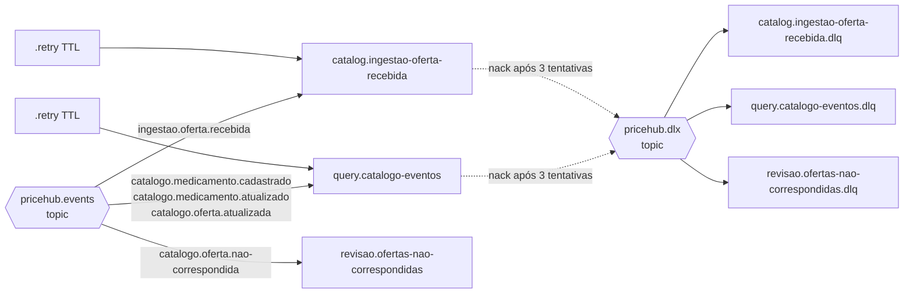

# Eventos e mensageria

Contratos em [`backend/packages/contracts`](../../backend/packages/contracts/src) (TypeBox). Toda mudança aqui acompanha a mudança do contrato **no mesmo commit**.

## Envelope (todos os eventos)

```ts
{
  eventId: string        // uuid v7 (ordenável no tempo), chave de idempotência
  type: string           // também é a routing key
  version: number        // versão do contrato de `data`
  occurredAt: string     // ISO 8601 UTC
  correlationId: string  // atravessa webhook → eventos → logs → SSE
  source: string         // serviço produtor
  data: object
}
```

Schema: [`envelope.ts`](../../backend/packages/contracts/src/envelope.ts) · criação: [`criar-envelope.ts`](../../backend/packages/contracts/src/criar-envelope.ts) · validação: [`validacao.ts`](../../backend/packages/contracts/src/validacao.ts).

## Catálogo de eventos

| Evento | Produtor → Consumidor | Quando é gerado | `data` | Ação no consumidor |
|---|---|---|---|---|
| `ingestao.oferta.recebida` v1 | ingestion → catalog | Para cada item recebido por webhook, sync ou polling que passou pela validação do modelo canônico | `{ origem: 'webhook' \| 'sync' \| 'polling', oferta: OfertaColetada }` | Matching; upsert da oferta; se o preço mudou, grava histórico e outbox |
| `catalogo.medicamento.cadastrado` v1 | catalog → query | Nenhuma estratégia de matching encontrou o medicamento e os dados mínimos são válidos | `{ medicamentoId, nome, principioAtivo, concentracao, forma, quantidade, categoria }` | Cria a entrada em `comparacao_medicamentos`; SSE `medicamento-cadastrado` |
| `catalogo.medicamento.atualizado` v1 | catalog → query | O medicamento foi **enriquecido** por uma fonte melhor (registro MS, categoria, fabricante, nome de exibição) | igual ao `cadastrado` | Atualiza os dados de exibição; SSE `medicamento-atualizado` |
| `catalogo.oferta.atualizada` v1 | catalog → query | Oferta nova ou preço alterado (preço igual **não** gera evento) | `{ ofertaId, medicamentoId, farmaciaId, farmaciaNome, precoAnteriorCentavos, precoAtualCentavos, atualizadoEm }` | Upsert em `comparacao_ofertas` (last-write-wins), recalcula menor/maior preço e quantidade de farmácias; SSE `oferta-atualizada` |
| `catalogo.oferta.nao-correspondida` v1 | catalog → fila de revisão | Matching impossível (princípio ativo vazio, ou forma não identificada sem registro MS/EAN) | `{ farmaciaId, externalId, motivo, oferta }` | Fica em `revisao.ofertas-nao-correspondidas` para inspeção humana |

> `catalogo.medicamento.atualizado` foi acrescentado ao conjunto inicial de quatro eventos. Quando a primeira oferta de um medicamento vem da DrogaPopular (sem registro MS e sem categoria), o medicamento canônico nasce com dados de exibição pobres. Sem esse evento, o read model nunca ficaria sabendo do enriquecimento feito depois por BioFarma ou FarmaAzul.

## Topologia (RabbitMQ)

Declarada em [`infra/rabbitmq/definitions.json`](../../infra/rabbitmq/definitions.json) e carregada no boot do broker.



| Fila | Bindings | DLX / DLQ | Retry |
|---|---|---|---|
| `catalog.ingestao-oferta-recebida` | `ingestao.oferta.recebida` | `pricehub.dlx` → `.dlq` | `.retry` |
| `query.catalogo-eventos` | `catalogo.medicamento.cadastrado`, `catalogo.medicamento.atualizado`, `catalogo.oferta.atualizada` | `pricehub.dlx` → `.dlq` | `.retry` |
| `revisao.ofertas-nao-correspondidas` | `catalogo.oferta.nao-correspondida` | `pricehub.dlx` → `.dlq` | `.retry` |

## Confiabilidade

| Mecanismo | Onde | Como |
|---|---|---|
| Publisher confirms | [`messaging/src/publicar.ts`](../../backend/packages/messaging/src/publicar.ts) | `ConfirmChannel`; a promessa só resolve após o ack do broker |
| Ack manual após commit | [`messaging/src/consumir.ts`](../../backend/packages/messaging/src/consumir.ts) | `ack` depois que o handler (e sua transação) termina |
| Retry exponencial | `consumir.ts` | Erro → republica em `<fila>.retry` com `expiration = base × 2^tentativa` (padrão 1 s, 2 s, 4 s) e header `x-retry-count`; a `.retry` devolve para a fila pela exchange padrão |
| DLQ | `consumir.ts` + DLX | Após 3 tentativas, ou contrato inválido → `nack(requeue=false)` → `pricehub.dlx` → `<fila>.dlq` |
| Transactional Outbox | [`catalog-service/src/modules/outbox`](../../backend/apps/catalog-service/src/modules/outbox) | Oferta + histórico + linha no `outbox` na mesma transação; relay a cada 500 ms com `FOR UPDATE SKIP LOCKED` e acionado logo após cada commit |
| Idempotent Consumer | [`messaging/src/idempotencia.ts`](../../backend/packages/messaging/src/idempotencia.ts) | `INSERT INTO eventos_processados ... ON CONFLICT DO NOTHING` na mesma transação do efeito |
| Ordem (LWW) | catalog e query | Oferta com `atualizadoEm` mais antigo que o gravado é ignorada |
| Reconexão | [`messaging/src/conexao.ts`](../../backend/packages/messaging/src/conexao.ts) | Backoff exponencial; consumidores são recriados ao reconectar |
| Encerramento gracioso | `conexao.fechar()` | Cancela consumidores e espera as mensagens em andamento antes de fechar |

## Correlation ID

1. Gerado no `PATCH /admin/produtos/:id/preco` da farmácia (ou aceito do header `X-Correlation-Id`).
2. Enviado no webhook (`X-Correlation-Id`); no sync/polling, o ingestion gera `sync-<farmacia>-<uuid>` / `polling-...`.
3. Copiado para o envelope de `ingestao.oferta.recebida` e para todos os eventos `catalogo.*` derivados.
4. Presente em todos os logs (`correlationId`) e no payload SSE.

Rastrear um fluxo: `docker compose logs --no-log-prefix | grep <correlationId>`.
