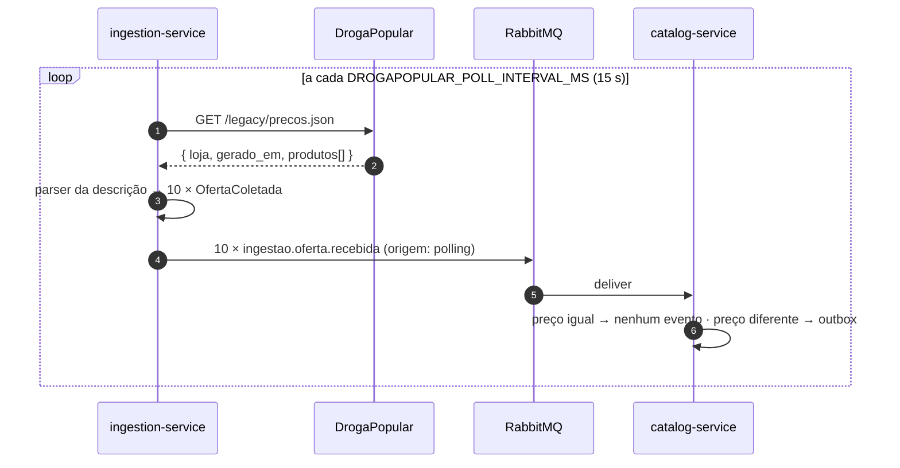

# Fluxo de atualização de preço (cenário de avaliação)

> Alterar o preço numa farmácia → gerar evento → PriceHub processa → informação centralizada é atualizada → novo preço é apresentado ao usuário.

Executável com `pnpm -C backend demo:preco` (Losartana na FarmaAzul: R$ 8,90 → R$ 7,20). Resultados medidos em [`docs/tcc/resultados-testes.md`](../tcc/resultados-testes.md).

## Webhook (BioFarma, FarmaAzul)

```mermaid
sequenceDiagram
    autonumber
    actor Op as Operador / demo
    participant F as FarmaAzul (farmacia-sim)
    participant I as ingestion-service
    participant MQ as RabbitMQ
    participant C as catalog-service
    participant DBC as Postgres catalog
    participant Q as query-service
    actor U as Usuário (SSE)

    U->>Q: GET /eventos/stream (conexão aberta)
    Op->>F: PATCH /admin/produtos/2/preco {precoCentavos: 720}
    F->>F: grava preço, gera X-Correlation-Id
    F-->>Op: 200 {webhook: "agendado", correlationId}
    F->>I: POST /webhooks/farmaazul (X-PriceHub-Signature, X-Correlation-Id)
    I->>I: valida HMAC, grava coleta bruta, adapter FarmaAzul → OfertaColetada
    I->>MQ: publish ingestao.oferta.recebida (confirm)
    I-->>F: 202 Accepted
    MQ->>C: deliver (catalog.ingestao-oferta-recebida)
    rect rgb(235, 245, 255)
    note over C,DBC: uma transação
    C->>DBC: INSERT eventos_processados (idempotência)
    C->>DBC: matching (registro MS) → medicamento Losartana
    C->>DBC: SELECT oferta FOR UPDATE; preço 890 ≠ 720
    C->>DBC: UPDATE oferta, INSERT historico_precos, INSERT outbox
    end
    C->>MQ: ack
    C->>C: relay acordado após o commit
    C->>DBC: SELECT outbox FOR UPDATE SKIP LOCKED
    C->>MQ: publish catalogo.oferta.atualizada (confirm)
    C->>DBC: UPDATE outbox SET publicado_em
    MQ->>Q: deliver (query.catalogo-eventos)
    rect rgb(235, 255, 235)
    note over Q: uma transação
    Q->>Q: INSERT eventos_processados; lock medicamento; LWW; upsert oferta; recalcula agregados
    end
    Q->>MQ: ack
    Q-->>U: SSE event: oferta-atualizada {precoAtualCentavos: 720, menorPrecoCentavos, correlationId}
    U->>Q: GET /medicamentos/:id/comparacao → FarmaAzul marcada como menor preço?
```

## Polling (DrogaPopular)



A latência no polling é limitada pelo intervalo (pior caso ≈ intervalo + processamento). O catalog filtra as ofertas sem mudança, de modo que o polling não inunda o query nem os clientes SSE.

## Onde o fluxo pode falhar e o que acontece

| Falha | Efeito | Recuperação |
|---|---|---|
| Webhook não chega (ingestion fora) | farmácia registra a falha | sync periódico (60 s) reconcilia |
| Assinatura inválida | 401, nada publicado | — (possível ataque) |
| RabbitMQ fora ao receber webhook | 503 para a farmácia | sync seguinte reconcilia |
| catalog fora | mensagens acumulam em `catalog.ingestao-oferta-recebida` | ao voltar, consome tudo (demo:resiliencia) |
| catalog cai entre commit e publish | evento fica no outbox | relay publica ao voltar |
| relay publica e cai antes de marcar | evento republicado | query descarta pelo `eventId` |
| query recebe oferta antes do medicamento | erro transitório | retry com atraso exponencial |
| erro persistente no handler | 3 tentativas | DLQ `<fila>.dlq` para análise |
