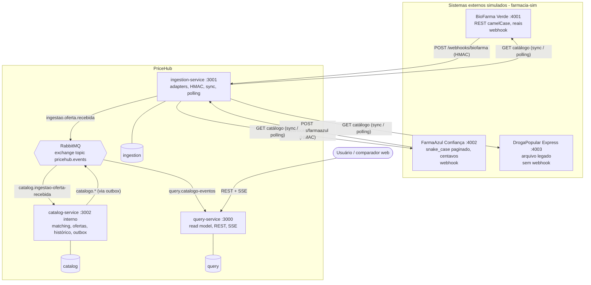

# Visão geral da arquitetura

O PriceHub integra farmácias heterogêneas, padroniza os dados num **modelo canônico**, identifica o mesmo medicamento em fontes diferentes, centraliza as ofertas e mostra ao usuário a comparação de preços atualizada em tempo real. A comunicação entre os serviços é **assíncrona, por eventos** (RabbitMQ).

## Diagrama de containers (C4 nível 2)

## Decisão de fronteira

As farmácias são **sistemas externos**: falam com o PriceHub **somente por HTTP**, seja por webhook assinado ou por polling e sync feitos pelo ingestion. Elas nunca publicam diretamente no broker ([ADR 0004](../adr/0004-fronteira-http-com-farmacias.md)). Dentro da fronteira do PriceHub, **nenhum serviço chama outro por HTTP**: toda a comunicação é por eventos ([ADR 0001](../adr/0001-microsservicos-orientados-a-eventos.md)).

| Fronteira | Protocolo | Motivo |
|---|---|---|
| Farmácia → PriceHub | HTTP (webhook HMAC, polling, sync) | parceiros externos não acessam o broker interno |
| Serviço → serviço | eventos no RabbitMQ | desacoplamento temporal, isolamento de falhas, escala independente |
| PriceHub → usuário | REST + Server-Sent Events | leitura simples e notificação em tempo real |

## Responsabilidades em uma frase

- **ingestion-service:** traduz o "idioma" de cada farmácia para o modelo canônico e publica `ingestao.oferta.recebida`.
- **catalog-service:** decide qual medicamento canônico uma oferta representa, guarda a verdade (ofertas, histórico) e publica `catalogo.*` com Transactional Outbox.
- **query-service:** mantém um read model desnormalizado para comparação e o entrega por REST e SSE.

## Banco por serviço

Um container PostgreSQL hospeda bancos lógicos separados (`ingestion`, `catalog`, `query`, `farmacia_<id>`); nenhum serviço conhece a `DATABASE_URL` de outro ([ADR 0006](../adr/0006-banco-por-servico.md)).

## Leituras seguintes

- [Serviços](servicos.md) · [Eventos](eventos.md) · [Fluxo de atualização de preço](fluxo-atualizacao-preco.md)
- [Modelo canônico](modelo-canonico.md) · [Matching](matching.md) · [Farmácias simuladas](farmacias-simuladas.md)
